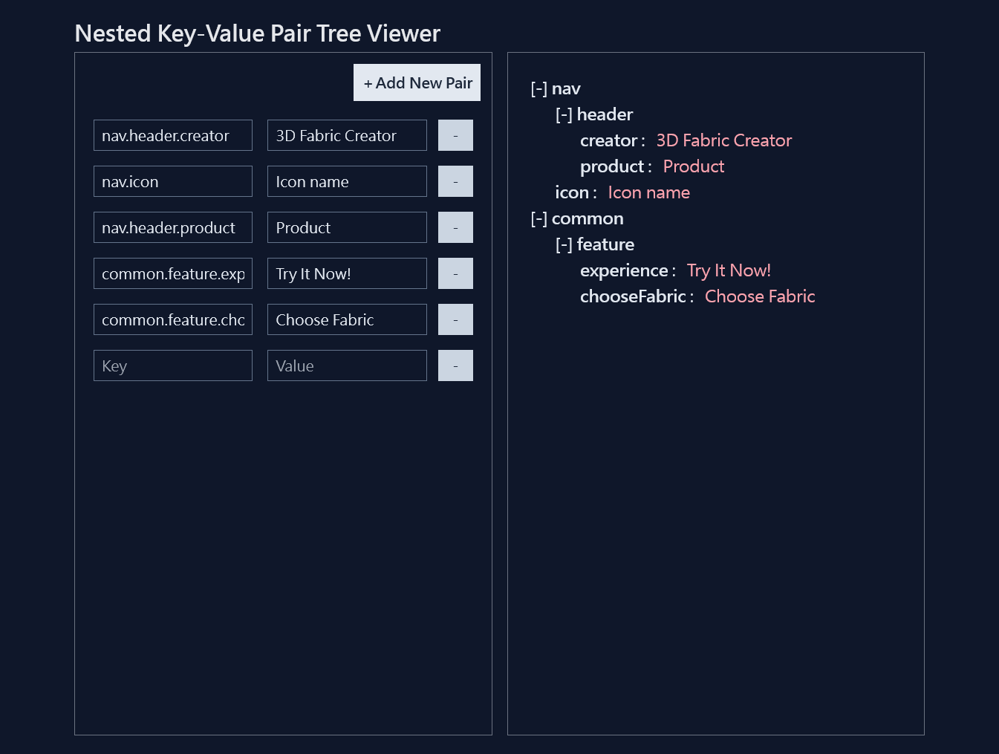

# Nested Key-Value Pair Tree Viewer

## Project Preview


Project Url :point_right: [Link](https://tsuki-nested-key-value-pair-tree-viewer.netlify.app)

- - -

## This project is currently built on

- [Vite](https://vitejs.dev/)
- [Vue3](https://vuejs.org/)
- [TypeScript](https://www.typescriptlang.org/)
- [Tailwind CSS](https://tailwindcss.com/)
- [Pug](https://pugjs.org/api/getting-started.html)

- - -

## Usage Guide

### Project setup
```
yarn install
```

### Compiles and hot-reloads for development
```
yarn dev
```

### Compiles and minifies for production
```
yarn build
```

### Preview production build before deploy
```
yarn preview
```
- - -

## Deploy Guide

[Deploy a Static Site | Vite](https://vitejs.dev/guide/static-deploy.html#netlify)

- - -

## Project Directory Explanation
    /src               - root directory of source code
    /src/styles        - CSS source code
    /src/assets        - root directory of static files

- - -

## Problems and Solutions

- - -
### Problem: vue-tsc type check fails on vue core when `compilerOptions.isolatedModules` flag in tsconfig is provided.

- [TypeScript Compiler Options](https://vitejs.dev/guide/features.html#typescript-compiler-options)
- [Github issue](https://github.com/vuejs/core/issues/1228#issuecomment-668978270)

### Solution: Set `skipLibCheck.compilerOptions` to `true`.

- - -
### Problem: Props are not recognized in recursive component when building the proejct.

- [Github issue](https://github.com/johnsoncodehk/volar/issues/394)
- [Github issue](https://github.com/johnsoncodehk/volar/issues/644)

### Solution: It's the limitation of TypeScript.  Use `defineAsyncComponent` to import recursive component instead of normal `import`.1