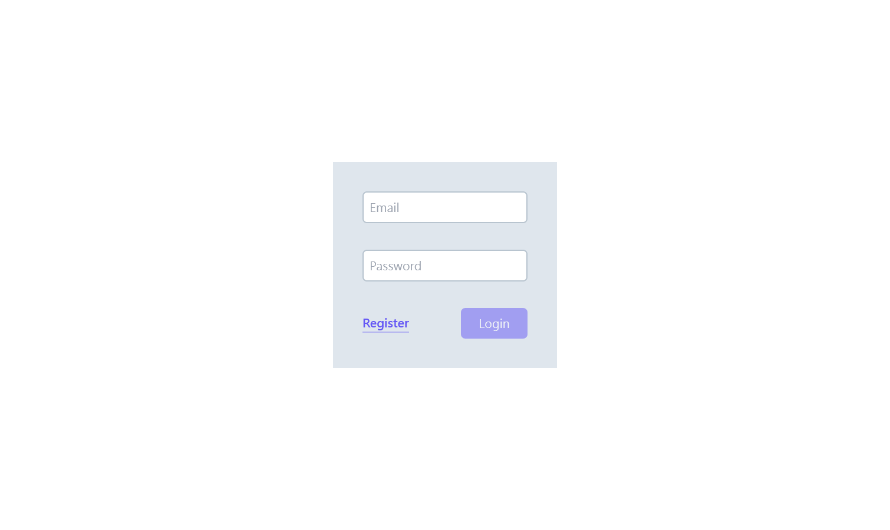
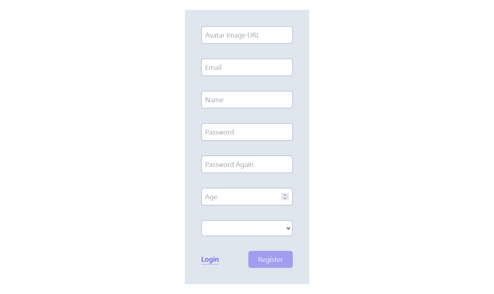
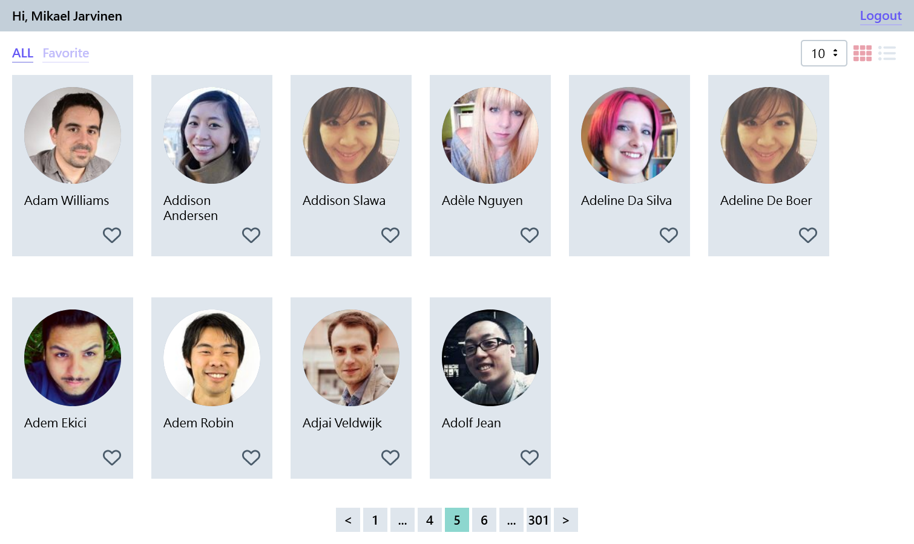
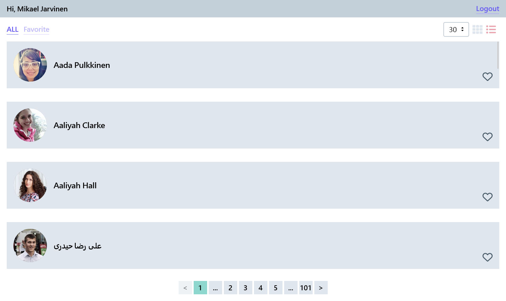
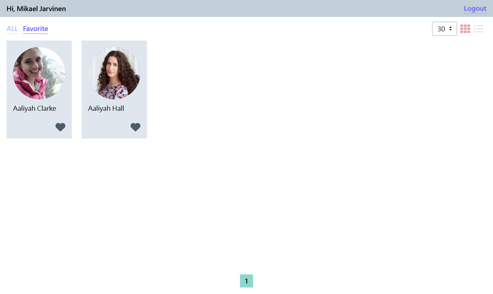

# Random User

## Project Preview







Project Url :point_right: [Link](https://tsuki-random-user.web.app/)

- - -

## This project is currently built on

- [Vite](https://vitejs.dev/)
- [Vue3](https://vuejs.org/)
- [Vue router 4](https://router.vuejs.org/)
- [Pinia](https://pinia.vuejs.org/)
- [TypeScript](https://www.typescriptlang.org/)
- [ts-node](https://github.com/TypeStrong/ts-node)
- [VeeValidate](https://vee-validate.logaretm.com/v4/)
- [yup](https://github.com/jquense/yup)
- [Tailwind CSS](https://tailwindcss.com/)
- [Pug](https://pugjs.org/api/getting-started.html)
- [Firebase](https://firebase.google.com/docs/reference)

- - -

## Project Installation Quide

1. Get started with Firebase.  Create a firebase project. [1](https://cloud.google.com/firestore/docs/client/get-firebase)
2. Go to `Project Settings` in Firebase console.  Get the `firebaseConfig` in General tab.  Save it to `firebaseConfig.ts` under the path - `${project_root}/src/secrets/`.  The content of `firebaseConfig.ts` should be like following:
```
export const firebaseConfig = {
  apiKey: "",
  authDomain: "",
  projectId: "",
  storageBucket: "",
  messagingSenderId: "",
  appId: "",
  measurementId: ""
};
```
3. Go to `Project Settings` in Firebase console.  Go to `Service Accounts` tab.  Create a private key and save it as `serviceAccount.json` under the path - `${project_root}/src/secrets/`.
4. Go to `Project Settings` in Firebase console.  Go to General tab.  Get the project number information and save it to `.firebaserc` under the path - `${project_root}/`.  The content of `.firebaserc` should be following:
```
{
  "projects": {
    "default": "<project number>"
  }
}
```
5. Install package dependency (If you haven't install Yarn, please install it first. [2](https://yarnpkg.com/getting-started/install) )
```
yarn install
```
6. Create dummy users and datas in Firebase.
```
yarn initialize
```
7. Done
- - -

## Usage Guide

### Compiles and hot-reloads for development
```
yarn dev
```

### Compiles and minifies for production
```
yarn build
```

### Preview production build before deploy
```
yarn preview
```

- - -

## Deploy Guide

[Deploy a Static Site | Vite](https://vitejs.dev/guide/static-deploy.html#google-firebase)

- - -

## Project Directory Explanation
    /src               - root directory of source code
    /src/styles        - CSS source code
    /src/views         - Vue views
    /src/components    - Vue components
    /src/stores        - Pinia store
    /src/router        - Vue Router config
    /src/services      - Firebase services
    /src/utils         - shared utility
    /src/types         - shared TypeScript types
    /src/secrets       - secret files
    /src/backend       - root directory of Firebase Admin related code

- - -

## Problems and Solutions

- - -
### Problem: ts-node doesn't have path resolution as tsc.
ref: [paths and baseUrl | ts-node](https://typestrong.org/ts-node/docs/paths/)

### Solution: Install and apply `tsconfig-path/register` plugin.

- - -

### Problem: Want to extract the same type definitions used by `defineProps` and `defineEmits` in `UserList.vue` and `UserCard.vue` into `userComponent.ts`.  But, failed with not supported yet.
ref: [How to import interface for defineProps | Github issue](https://github.com/vuejs/core/issues/4294)

### Solution: Problem is not solved due to this feature is not supported yet.  Left the same type definitions lie on two files.

- - -

### Problem: Firestore doesn't provide pagination with the ability to jump to certain page.

### Solution: Use `enableIndexedDbPersistence` on Firestore, and query the all documents in collection.  Save the documents to IndexedDB and Pinia store.  Build pagination with Pinia store.  By using `enableIndexedDbPersistence`, it could reduce further read cost.